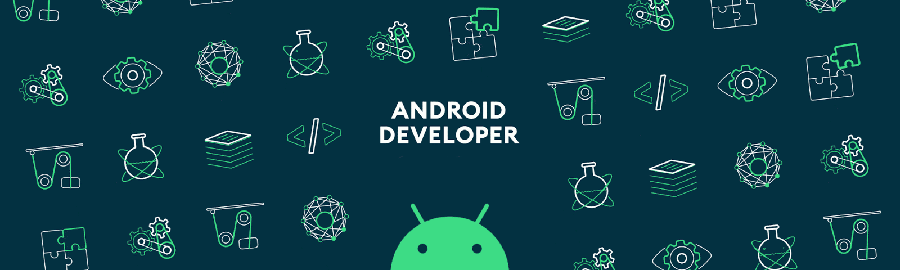

  
  

### 
Hi 👋, I'm Maliheh Moradi
  
<h3 align="center">A passionate Mobile Developer</h3> 

- 🔭 I’m currently working on [Android-Dot-App](https://myket.ir/app/co.omidtech.mobile.plus.prod.release)

- 🌱 I’m currently learning [Jetpack Compose](https://developer.android.com/jetpack/compose)

- ❓ Ask me about anything related to Modern Android development

- 📫 How to reach me **m.moradi.ps@gmail.com**

- 📃 You can see **[My Resume](assets/MalihehMoradi_resume_v1.0.1.pdf)**
  

   

## My Skill Set  
 

  
  
  
  
   
  
  

   

## Connect with me  

<!--  -->

<!--  -->

<!--  -->
<!--  -->
<!--    -->

  
  

   

## Github Stats  

 

  

  

 

<!-- ## Projects

  

  

  -->

 

<!--      -->
<!--      -->

 
